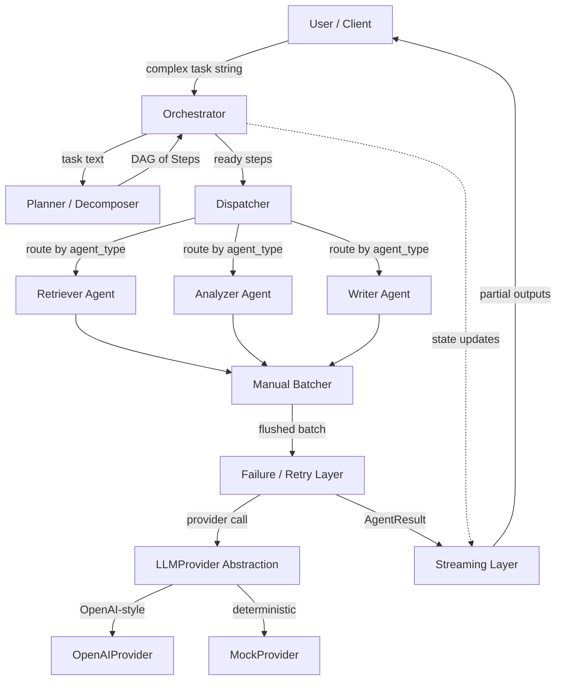
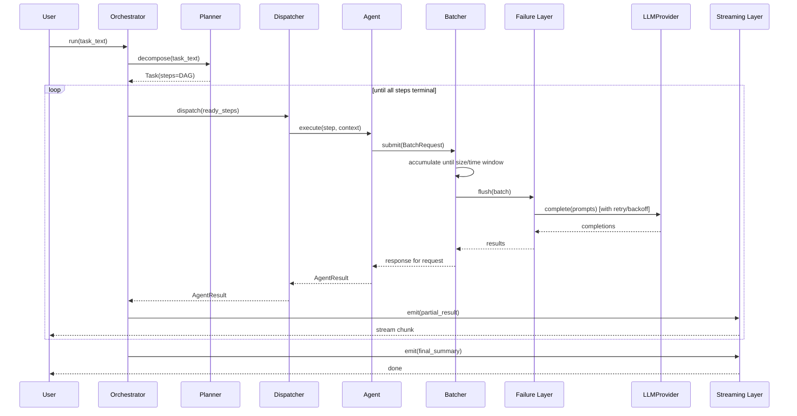
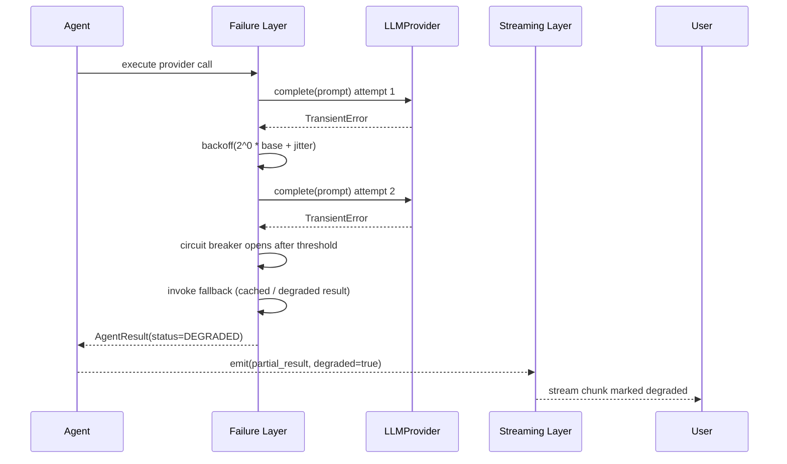

# Design Document: Agentic AI System for Multi-Step Tasks

## Overview

This system accepts a complex, multi-part user request, decomposes it into an ordered set of discrete steps, and executes those steps using specialized agents (Retriever, Analyzer, Writer) coordinated by an async pipeline. Results stream to the user as they become available, and the system degrades gracefully when individual steps fail through retries, fallbacks, and partial-result streaming.

The architecture is intentionally built from first principles in Python with `asyncio`. We deliberately avoid black-box agent frameworks (LangChain, CrewAI, AutoGen) as the core engine because the task requires demonstrating an understanding of what happens "under the hood" — particularly the manual batching of LLM requests and the failure-handling control flow. The only external dependency at the core is an LLM client, and even that is hidden behind a pluggable `LLMProvider` interface so the system runs end-to-end with a deterministic `MockProvider` (no API key required) for reproducible testing of both the happy path and the failure path.

The design favors composability: each layer (planning, dispatch, batching, streaming, failure handling) is an independent component with an explicit contract, making the system testable with property-based tests and easy to reason about.

## Architecture



The Orchestrator owns the overall lifecycle. The Planner converts free text into a DAG of `Step` objects. The Dispatcher selects ready steps (dependencies satisfied) and routes each to the agent matching its `agent_type`. Agents express their LLM needs as `BatchRequest` objects sent to the manual Batcher, which groups them by size or time window before flushing. Each flush passes through the Failure/Retry layer, which calls the `LLMProvider`. Results flow back through the Streaming layer to the user incrementally.

## Sequence Diagrams

### Main Happy-Path Flow



### Failure / Degradation Flow



## Components and Interfaces

### Component 1: Orchestrator

**Purpose**: Owns the end-to-end lifecycle of a task run: invokes the planner, drives the execution loop over the DAG, aggregates results, and feeds the streaming layer.

**Interface**:
```python
class Orchestrator:
    def __init__(self, planner: Planner, dispatcher: Dispatcher,
                 stream: StreamBus) -> None: ...

    async def run(self, task_text: str) -> Task:
        """Decompose, execute the DAG to completion, return the final Task."""

    async def _execute_dag(self, task: Task) -> None:
        """Repeatedly schedule ready steps until all are terminal."""
```

**Responsibilities**:
- Call the Planner to build the `Task` DAG.
- Determine which steps are "ready" (all dependencies COMPLETED).
- Schedule ready steps concurrently and collect their `AgentResult`s.
- Emit partial results and lifecycle events to the `StreamBus`.
- Ensure termination: every step reaches a terminal status (COMPLETED, DEGRADED, or FAILED).

### Component 2: Planner / Decomposer

**Purpose**: Convert a free-text task into an ordered DAG of `Step` objects with assigned agent types and dependency edges.

**Interface**:
```python
class Planner:
    def __init__(self, provider: LLMProvider) -> None: ...

    async def decompose(self, task_text: str) -> Task:
        """Produce a Task whose steps form a valid DAG (no cycles)."""
```

**Responsibilities**:
- Produce at least one step for any non-empty task.
- Assign each step an `agent_type` from the known registry.
- Encode dependencies so the result is acyclic.
- Guarantee a topological ordering exists.

### Component 3: Agent Base Class + Specialized Agents

**Purpose**: Define a uniform execution contract for all agents and provide three specializations.

**Interface**:
```python
class Agent(ABC):
    agent_type: str

    @abstractmethod
    async def execute(self, step: Step, context: ExecutionContext) -> AgentResult:
        """Perform the step's work, possibly via batched LLM calls."""

class RetrieverAgent(Agent):
    agent_type = "retriever"   # gathers source material / context

class AnalyzerAgent(Agent):
    agent_type = "analyzer"    # reasons over retrieved material

class WriterAgent(Agent):
    agent_type = "writer"      # produces final user-facing prose
```

**Responsibilities**:
- Translate a `Step` into one or more `BatchRequest`s.
- Read upstream results from `ExecutionContext` (dependency outputs).
- Return a well-formed `AgentResult` (never raise past its own boundary; failures become `AgentResult(status=FAILED)`).

### Component 4: LLMProvider Abstraction

**Purpose**: Decouple the engine from any specific LLM vendor and enable deterministic, key-free testing.

**Interface**:
```python
class LLMProvider(ABC):
    @abstractmethod
    async def complete(self, prompts: list[str]) -> list[Completion]:
        """Batch completion. Input order == output order."""

class OpenAIProvider(LLMProvider):
    """Wraps an OpenAI-style async client."""

class MockProvider(LLMProvider):
    """Deterministic responses keyed by prompt; can be configured to
    fail on specific prompts to reproduce the failure path."""
```

**Responsibilities**:
- Accept a list of prompts and return completions in the same order.
- Surface transient vs. permanent failures as distinct exception types.
- `MockProvider` MUST be deterministic given the same input.

### Component 5: Manual Batcher

**Purpose**: Group individual agent LLM requests into batches by size or time window, then flush them as a single provider call — implemented explicitly, with no framework hiding the logic.

**Interface**:
```python
class Batcher:
    def __init__(self, provider: LLMProvider, max_batch_size: int,
                 max_wait_ms: int) -> None: ...

    async def submit(self, request: BatchRequest) -> Completion:
        """Enqueue a request; resolves when the request's batch is flushed."""

    async def _run_loop(self) -> None:
        """Background loop that flushes on size or time-window trigger."""
```

**Responsibilities**:
- Accumulate requests until `max_batch_size` reached OR `max_wait_ms` elapsed since the first queued request.
- Preserve request-to-response correspondence across the batch.
- Flush partial batches when the time window expires (no starvation).

### Component 6: Streaming Layer

**Purpose**: Deliver partial outputs to the user as they are produced, decoupled from execution speed.

**Interface**:
```python
class StreamBus:
    def emit(self, event: StreamEvent) -> None:
        """Non-blocking publish of a partial result or lifecycle event."""

    async def subscribe(self) -> AsyncIterator[StreamEvent]:
        """Async generator the client consumes."""
```

**Responsibilities**:
- Preserve emission order per task.
- Never block the producer (bounded queue with backpressure policy).
- Mark degraded results explicitly so the client can render them differently.

### Component 7: Failure / Retry Layer

**Purpose**: Wrap provider calls with retry-with-backoff, a circuit breaker, and fallback logic to enable graceful degradation.

**Interface**:
```python
class FailureHandler:
    def __init__(self, max_retries: int, base_delay_ms: int,
                 breaker_threshold: int) -> None: ...

    async def call(self, op: Callable[[], Awaitable[T]],
                   fallback: Callable[[], Awaitable[T]] | None = None) -> T:
        """Run op with retry/backoff; open breaker on repeated failure;
        invoke fallback if available, else re-raise."""
```

**Responsibilities**:
- Retry only on transient errors, up to `max_retries`.
- Use exponential backoff with jitter between attempts.
- Open the circuit breaker after `breaker_threshold` consecutive failures and short-circuit further calls.
- Invoke the fallback to produce a DEGRADED result when retries are exhausted.

## Data Models

### Model: Step

```python
class StepStatus(Enum):
    PENDING = "pending"
    RUNNING = "running"
    COMPLETED = "completed"
    DEGRADED = "degraded"
    FAILED = "failed"

@dataclass
class Step:
    id: str
    description: str
    agent_type: str            # "retriever" | "analyzer" | "writer"
    depends_on: list[str]      # ids of prerequisite steps
    status: StepStatus = StepStatus.PENDING
    result: "AgentResult | None" = None
```

**Validation Rules**:
- `id` is unique within a Task.
- `agent_type` must exist in the agent registry.
- Every id in `depends_on` must reference an existing Step in the same Task.
- `depends_on` must not introduce a cycle.

### Model: Task

```python
@dataclass
class Task:
    id: str
    text: str                  # original user request
    steps: list[Step]          # nodes of the DAG

    def ready_steps(self) -> list[Step]:
        """Steps whose dependencies are all COMPLETED and that are PENDING."""

    def is_terminal(self) -> bool:
        """True when every step is COMPLETED, DEGRADED, or FAILED."""
```

**Validation Rules**:
- `steps` forms a Directed Acyclic Graph (topological order exists).
- At least one step has no dependencies (a valid entry point).
- `text` is non-empty.

### Model: AgentResult

```python
class ResultStatus(Enum):
    OK = "ok"
    DEGRADED = "degraded"
    FAILED = "failed"

@dataclass
class AgentResult:
    step_id: str
    status: ResultStatus
    output: str
    error: str | None = None
    attempts: int = 1
    degraded: bool = False
```

**Validation Rules**:
- `status == FAILED` implies `error` is non-null.
- `status == DEGRADED` implies `degraded == True`.
- `output` is always a string (empty allowed only when FAILED).

### Model: BatchRequest

```python
@dataclass
class BatchRequest:
    request_id: str
    prompt: str
    enqueued_at: float         # monotonic timestamp (seconds)
    future: asyncio.Future     # resolved with the matching Completion
```

**Validation Rules**:
- `request_id` is unique within the Batcher's lifetime.
- `prompt` is non-empty.
- `future` is unresolved at enqueue time.

## Algorithmic Pseudocode

### Manual Batching Algorithm (Core — Not a Black Box)

This is the heart of the "show your work" requirement. The Batcher runs a single background loop that drains a queue, deciding when to flush based on two independent triggers: a **size trigger** (batch is full) and a **time-window trigger** (oldest queued request has waited long enough). This prevents both inefficiency (too many tiny calls) and starvation (a lone request waiting forever).

```python
async def submit(self, request: BatchRequest) -> Completion:
    # Producer side: enqueue and await the future resolved by the flush.
    await self._queue.put(request)
    return await request.future


async def _run_loop(self) -> None:
    """Background consumer: builds and flushes batches."""
    while not self._stopped:
        batch: list[BatchRequest] = []

        # 1. Block for the FIRST request (no busy-wait when idle).
        first = await self._queue.get()
        batch.append(first)
        window_deadline = first.enqueued_at + (self.max_wait_ms / 1000)

        # 2. Fill the batch until size limit OR time window expires.
        while len(batch) < self.max_batch_size:
            remaining = window_deadline - monotonic()
            if remaining <= 0:
                break  # time-window trigger
            try:
                nxt = await asyncio.wait_for(self._queue.get(),
                                             timeout=remaining)
                batch.append(nxt)            # size trigger may fire next loop
            except asyncio.TimeoutError:
                break  # time-window trigger

        # 3. Flush: one provider call for the whole batch.
        await self._flush(batch)


async def _flush(self, batch: list[BatchRequest]) -> None:
    prompts = [r.prompt for r in batch]
    try:
        completions = await self._failure.call(
            op=lambda: self._provider.complete(prompts),
            fallback=lambda: self._degraded_completions(prompts),
        )
        # 4. Map each completion back to its originating request by index.
        for req, comp in zip(batch, completions):
            if not req.future.done():
                req.future.set_result(comp)
    except Exception as exc:
        for req in batch:
            if not req.future.done():
                req.future.set_exception(exc)
```

**Preconditions:**
- `max_batch_size >= 1` and `max_wait_ms >= 0`.
- `self._provider.complete` returns completions in input order.

**Postconditions:**
- Every submitted request's future is eventually resolved (with a result or an exception).
- A batch is flushed when it reaches `max_batch_size` OR when `max_wait_ms` elapses since its first request, whichever comes first.
- Completion `i` is delivered to request `i` of the flushed batch.

**Loop Invariants:**
- `batch` is non-empty after the first `get()` (it always contains `first`).
- `len(batch) <= max_batch_size` at all times.
- `window_deadline` is fixed by the first request and never extended by later arrivals.

### Orchestrator DAG Execution Algorithm

```python
async def _execute_dag(self, task: Task) -> None:
    while not task.is_terminal():
        ready = task.ready_steps()
        if not ready:
            # No ready steps but not terminal => some dependency FAILED.
            self._mark_blocked_as_failed(task)
            break

        # Schedule all ready steps concurrently.
        coros = [self._run_step(task, step) for step in ready]
        results = await asyncio.gather(*coros, return_exceptions=False)

        for step, result in zip(ready, results):
            step.result = result
            step.status = self._map_status(result.status)
            self._stream.emit(StreamEvent.partial(step.id, result))
```

**Preconditions:**
- `task.steps` is a valid DAG.

**Postconditions:**
- Every step reaches a terminal status; the loop terminates.
- Partial results are emitted in completion order.

**Loop Invariants:**
- The set of COMPLETED steps grows monotonically each iteration (or the loop exits via the blocked branch), guaranteeing progress and termination.

### Failure Handler Algorithm (Retry + Backoff + Breaker + Fallback)

```python
async def call(self, op, fallback=None):
    if self._breaker_open():
        return await self._use_fallback_or_raise(fallback,
                                                  CircuitOpenError())
    attempt = 0
    while True:
        try:
            result = await op()
            self._record_success()
            return result
        except PermanentError:
            raise                              # never retry permanent errors
        except TransientError as exc:
            attempt += 1
            self._record_failure()
            if attempt > self.max_retries or self._breaker_open():
                return await self._use_fallback_or_raise(fallback, exc)
            delay = self._backoff(attempt)     # base * 2^(attempt-1) + jitter
            await asyncio.sleep(delay)
```

**Preconditions:**
- `op` raises either `TransientError` or `PermanentError` on failure.
- `max_retries >= 0`, `base_delay_ms >= 0`.

**Postconditions:**
- Returns `op`'s result on success.
- On exhausted transient retries: returns the fallback result if provided, else raises.
- `PermanentError` propagates immediately without retry.

**Loop Invariants:**
- `attempt <= max_retries + 1` across all iterations.
- Backoff delay is non-decreasing in `attempt` (modulo jitter).

## Key Functions with Formal Specifications

### Function: Planner.decompose

```python
async def decompose(self, task_text: str) -> Task
```

**Preconditions:**
- `task_text` is a non-empty string.

**Postconditions:**
- Returns a `Task` with at least one `Step`.
- The steps form a DAG (a topological ordering exists).
- Every `Step.agent_type` is registered.

**Loop Invariants:** N/A.

### Function: Task.ready_steps

```python
def ready_steps(self) -> list[Step]
```

**Preconditions:**
- `self.steps` is a valid DAG.

**Postconditions:**
- Returns exactly the PENDING steps whose every dependency is COMPLETED.
- Returns an empty list when no such step exists.

**Loop Invariants:**
- Each step is inspected at most once; dependency lookups read only COMPLETED states.

## Example Usage

```python
# Example 1: Run end-to-end with the deterministic MockProvider (no API key).
provider = MockProvider(responses={"retrieve:*": "sources...",
                                    "analyze:*": "findings...",
                                    "write:*": "final report..."})
batcher = Batcher(provider, max_batch_size=8, max_wait_ms=50)
failure = FailureHandler(max_retries=3, base_delay_ms=20, breaker_threshold=5)
stream = StreamBus()

orchestrator = Orchestrator(
    planner=Planner(provider),
    dispatcher=Dispatcher(agents=[RetrieverAgent(batcher),
                                  AnalyzerAgent(batcher),
                                  WriterAgent(batcher)]),
    stream=stream,
)

async def main():
    # Consume the stream concurrently with execution.
    async def consume():
        async for event in stream.subscribe():
            print(event.kind, event.payload)

    consumer = asyncio.create_task(consume())
    task = await orchestrator.run(
        "Research async batching, analyze tradeoffs, and write a summary."
    )
    await consumer
    assert task.is_terminal()

# Example 2: Reproduce the failure path deterministically.
failing = MockProvider(responses={...}, fail_on={"analyze:*"})  # raises TransientError
# -> retries with backoff, breaker may open, analyzer step ends DEGRADED,
#    writer still runs on degraded input, user sees a degraded-marked chunk.

# Example 3: Swap in a real provider with zero code changes elsewhere.
provider = OpenAIProvider(model="gpt-4o-mini")   # same LLMProvider contract
```

## Correctness Properties

These are the universally-quantified properties to verify with property-based testing (library: **Hypothesis**).

### Property 1: Batch size bound

∀ flushed batches `b`, `1 <= len(b) <= max_batch_size`.

**Validates: Requirements 6.2, 6.4**

### Property 2: No lost requests

∀ submitted `BatchRequest` `r`, `r.future` is eventually resolved (result or exception). No request is dropped.

**Validates: Requirements 6.1, 6.6**

### Property 3: Order preservation in batches

∀ flushed batch `b`, completion at index `i` is delivered to request at index `i`.

**Validates: Requirements 6.5, 7.2**

### Property 4: Time-window guarantee

∀ request `r` that is the first in its batch, `r` is flushed within `max_wait_ms` (plus provider latency); no starvation.

**Validates: Requirements 6.3, 6.7**

### Property 5: DAG termination

∀ valid `Task` `t`, `_execute_dag(t)` terminates and `t.is_terminal()` holds afterward.

**Validates: Requirements 4.3, 4.4, 4.5**

### Property 6: Topological respect

∀ step `s`, `s` only RUNS after every step in `s.depends_on` is COMPLETED.

**Validates: Requirements 2.2, 4.2**

### Property 7: Retry bound

∀ provider operation, the number of attempts `<= max_retries + 1`.

**Validates: Requirements 8.1, 8.2, 8.3, 8.7**

### Property 8: No retry on permanent errors

∀ operation raising `PermanentError`, attempts `== 1`.

**Validates: Requirements 8.4**

### Property 9: Graceful degradation

∀ step whose provider call exhausts retries with a fallback available, the resulting `AgentResult.status == DEGRADED` (not FAILED) and `degraded == True`.

**Validates: Requirements 8.5, 8.6, 9.2**

### Property 10: Determinism of MockProvider

∀ prompt list `p`, `MockProvider.complete(p)` returns identical output across runs.

**Validates: Requirements 7.4**

### Property 11: Stream ordering

Partial events for a single task are observed by the subscriber in emission order.

**Validates: Requirements 5.2, 5.4**

### Property 12: AgentResult invariant

∀ result `r`, `r.status == FAILED ⟹ r.error is not None`.

**Validates: Requirements 9.1, 9.3, 3.5**

## Error Handling

### Error Scenario 1: Transient Provider Error (timeout, rate limit, 5xx)

**Condition**: `LLMProvider.complete` raises `TransientError`.
**Response**: Failure layer retries with exponential backoff + jitter up to `max_retries`.
**Recovery**: Success on a later attempt resolves normally; otherwise fall back to a degraded result.

### Error Scenario 2: Permanent Provider Error (auth failure, malformed request)

**Condition**: `LLMProvider.complete` raises `PermanentError`.
**Response**: No retry; the error propagates immediately to the flush handler.
**Recovery**: All requests in the batch have their futures set to the exception; affected steps become FAILED with `error` populated.

### Error Scenario 3: Repeated Failures (provider unhealthy)

**Condition**: `breaker_threshold` consecutive failures recorded.
**Response**: Circuit breaker opens; subsequent calls short-circuit without hitting the provider.
**Recovery**: Calls use fallback (cached/degraded output) producing DEGRADED results; breaker half-opens after a cooldown to probe recovery.

### Error Scenario 4: Dependency Failed (blocked step)

**Condition**: A step's dependency reached FAILED, so the step can never become ready.
**Response**: Orchestrator detects "no ready steps but task not terminal" and marks blocked steps FAILED.
**Recovery**: The DAG still terminates; the user receives a clear FAILED marker for the blocked branch while other branches stream normally.

### Error Scenario 5: Stream Backpressure

**Condition**: Consumer is slower than the producer; the bounded queue fills.
**Response**: Producer applies the configured backpressure policy (await space, or drop-oldest with a marker).
**Recovery**: No deadlock; producer continues once space frees or per policy.

## Testing Strategy

### Unit Testing Approach

- **Batcher**: verify size-trigger flush, time-window-trigger flush, partial-batch flush, and request/response index mapping. Use a fake clock and a counting `MockProvider`.
- **FailureHandler**: verify retry count bounds, no-retry-on-permanent, backoff growth, breaker open/half-open transitions, and fallback invocation.
- **Planner**: verify non-empty tasks produce valid DAGs with registered agent types.
- **Orchestrator**: verify topological execution and termination, including the blocked-dependency branch.
- Coverage goal: all branches in the batching and failure algorithms exercised.

### Property-Based Testing Approach

Encode the 12 correctness properties above as Hypothesis tests.

**Property Test Library**: Hypothesis (Python).

- Generate random valid DAGs (random step counts, dependency edges constrained to be acyclic) and assert termination + topological respect.
- Generate random submit schedules (varying arrival times and counts) against a fake clock and assert batch-size bound, no-lost-requests, order preservation, and time-window guarantee.
- Generate random failure schedules (transient/permanent mixes) and assert retry bounds and degradation behavior.

### Integration Testing Approach

- End-to-end run with `MockProvider` (happy path) asserting the final `Task` is terminal and the stream produced the expected ordered events.
- End-to-end run with `MockProvider` configured via `fail_on` to reproduce the failure path, asserting a DEGRADED result streams to the consumer and the run still terminates.

## Performance Considerations

- **Batching** amortizes provider round-trips: tune `max_batch_size` vs. `max_wait_ms` to trade latency for throughput.
- **Concurrency**: ready steps run via `asyncio.gather`, so independent DAG branches progress in parallel without threads.
- **Bounded queues** in the stream and batcher prevent unbounded memory growth under load.
- **Backoff jitter** spreads retry storms to avoid synchronized hammering of a recovering provider.

## Security Considerations

- **API keys**: read from environment/secret store only in `OpenAIProvider`; never logged. The default test path uses `MockProvider` with no secrets.
- **Prompt handling**: treat task text and retrieved content as untrusted input; do not let it alter control flow (it is data, not instructions to the engine).
- **Resource limits**: per-task step cap and per-batch size cap bound worst-case provider spend and memory.

## Dependencies

- **Python 3.11+** with the standard library `asyncio` (core engine).
- **Hypothesis** — property-based testing.
- **pytest** + **pytest-asyncio** — test runner for async code.
- **An OpenAI-style async client** (optional, only for `OpenAIProvider`; not required to run or test the system).

### Justification for the No-Black-Box Constraint

Per the brief, we do **not** use LangChain, CrewAI, or AutoGen as the core engine. The orchestration, planning, dispatch, batching, streaming, and failure handling are all implemented directly on `asyncio` so the control flow — especially the manual batching loop and the retry/breaker/fallback logic — is fully visible and testable. The only optional third-party piece is the LLM client used inside `OpenAIProvider`, and it sits behind the `LLMProvider` interface; the deterministic `MockProvider` lets the entire system run and be verified without any external service or API key. This satisfies the requirement to demonstrate understanding of what happens under the hood while keeping the engine vendor-agnostic.
